# Fetch aosp
根据手机型号自动生成aosp源码下载脚本
## 问题
通常我们在编译aosp源码的时候，要找手机型号、源码分支、手机驱动信息等，很多时候需要我们人工去查找，这样很麻烦，所以这里我写了一个脚本来自动生成编译源码的脚本，这样我们只需要输入手机型号，就可以自动生成编译源码的脚本，方便我们编译源码。


在执行源码下载和编译的时候，我们需要根据自身设备的型号和源码分支来确定要编译的程序，同时还需要我们在lunch对应的程序，这样我们才能编译出我们需要的程序。

例如，要想编译Pixel3的aosp源码，我们需要执行以下命令：
* 首先选择build的配置，查看对应的编译代号

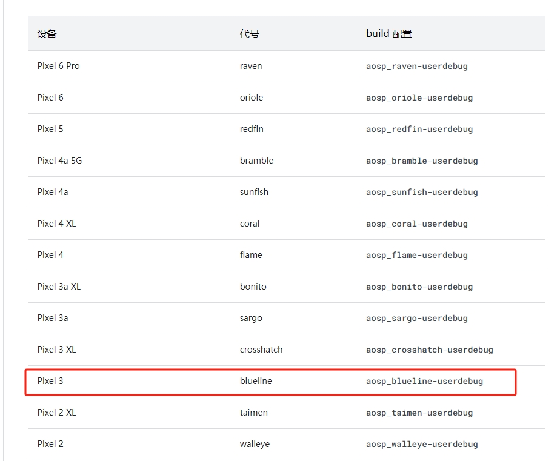
例如这里选择Pixel3 blueline  编译的lunch名称为 aosp_blueline-userdebug
* 然后选择对应的源码分支.明确了设备的编译代号后，选择源码分支
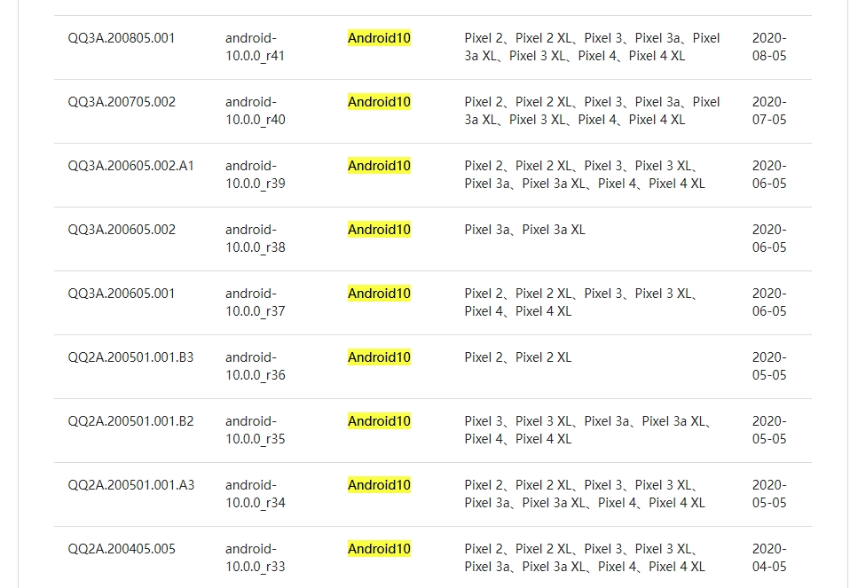
例如这里的android10 我们选择支持设备更多的分支，这样设备的稳定性会更高，这里选择 `QQ3A.200805.001 android-10.0.0_r41` 
* 然后选择对应的lunch的配置。在我们选择编译的时候，直接执行命令 
```sh
lunch aosp_blueline-userdebug
```
执行编译
```sh
make  -j32
```
等待编译结束即可。
为了能够正常刷机，我们还要下载驱动文件解压到源码目录下了，接着编译后的镜像才能刷入我们的设备，但是选择设备的驱动文件时，我们也要注意源码的分支和手机的型号都要对上，否则刷机后会导致设备无法启动。
例如这里选择的是`Pixel3 QQ3A.200805.001 ` 那么我们在驱动路径选择的时候就要选择`QQ3A.200805.001` 对应的驱动文件了，由于这里有很多相同的代号，也要注意区别不同手机版本，例如
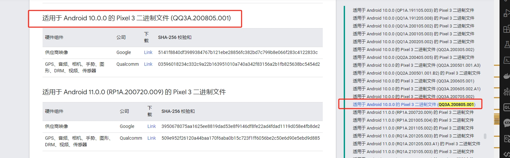

注意右边的搜索栏出现了很多`QQ3A.200805.001`的搜索结果。

## 这个程序作了什么
这个程序实现了自动化的源码下载，编译，驱动文件下载，编译，刷机，并且支持多设备，多分支的编译。

首先我们先同步一下官方文档的信息，启动如下
```sh
python cli.py
```


输入help进行查看支持的命令
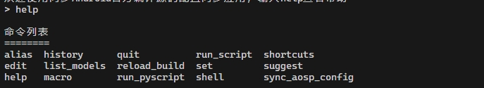
主要使用的三个命令
* sync_aosp_config --同步google的文档信息 保存在当前目录下的`buid_configs`
* suggest -- 根据同步的信息进行生成编译脚本 `生成的shell脚本，保存在buidl_scripts目录下`
* reload_build -- 重新生成编译脚本

## sync_aosp_config 同步官方配置信息
执行命令如下
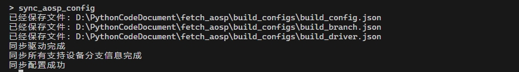
## 生成编译脚本 suggest
首先选择设备型号
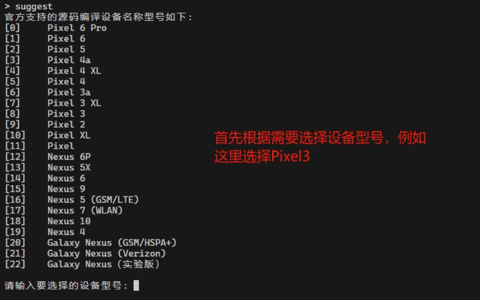
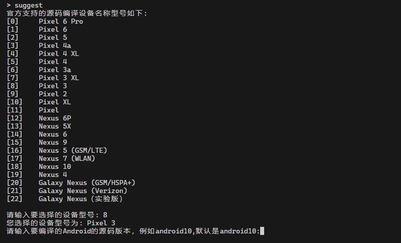

接着选择源码版本，可以输入或者默认使用，如下
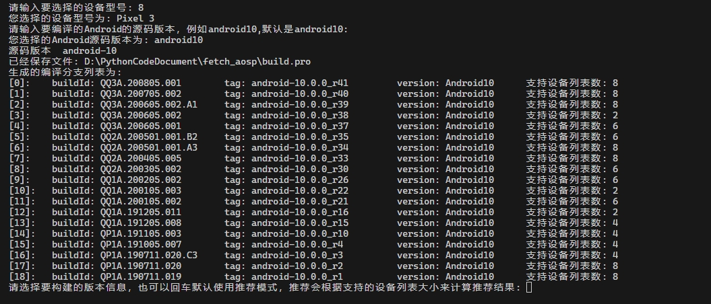
一般我们会使用支持的设备列表更多的分支，所以，这里默认使用推荐的即可，直接回车即可，如下
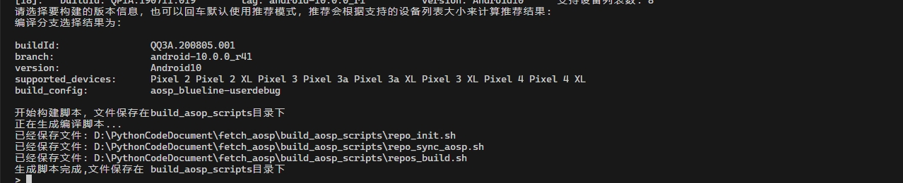
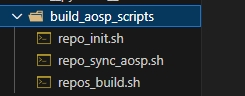
由于是在国内同步，则需要使用代理源，这里使用的是清华大学的，也可以使用其他的源，最终结果如下
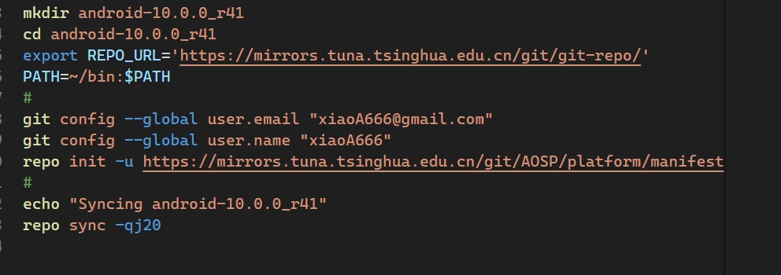

## 说明
由于我已经存了一份config,可以不需要一直保持同步，如果有需要再重新同步即可。我们可以直接执行生成配置命令，然后再执行相关操作。